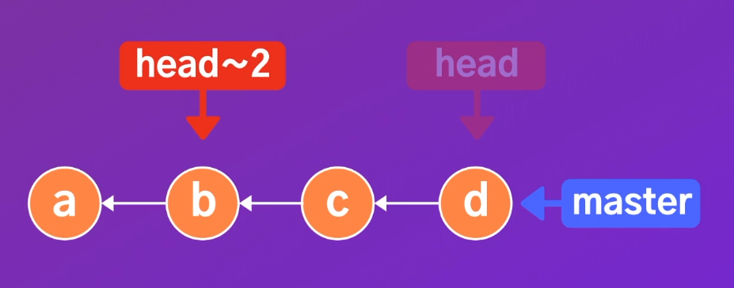

# 깃

# 1. Git의 동작 원리

---

## Head란?

head : 현재 내가 보고있는 시점의 버전을 가리킨다.
head~1 : 현재 헤드의 이전 버전을 가리킨다. (첫번째 부모)
head~2 : 현재 헤드의 두번째 부모를 가리킨다.

커밋 c로 돌아가고 싶다면, "git checkout"를 이용해서 돌아갈 수 있다.
git log로 커밋 c의 해시값을 복사하고 "git checkout c3b0abc"을 타이핑해서 커밋 c로 돌아갈 수 있다. (해당 해시값은 예시이다.)

# 2. git 명령어

---

### git config

- git config —list : 모든 설정들을 확인해 볼 수 있다.
- git config --global -e : 설정을 파일로 열고 싶을 때

### git status

- git status : git의 상태 확인하기
- git status -s : git의 상태를 간략하게 확인하기

### git add

- git add *.txt : 특정 파일(ex. txt파일) 형태만 staging하기
- git rm —cached * : staging된 모든 파일들을 다시 working 디렉토리로 내리기

### git diff

- git diff : working 디렉토리의 어떤 파일의 내용이 수정되었는지 확인할 수 있다. (이전 커밋 또는 현재 스테이징 영역의 파일 내용 기준)
- git diff —staged : 스테이징 영역에 있는 파일들이 이전 커밋과 비교했을 때, 수정된 내용을 확인할 수 있다.
- git difftool →

    'git config --global -e' 를 타이핑해서 설정 파일을 열고, 다음을 추가하고 저장한다.
    [diff]
    	tool = vscode;
    [difftool "vscode"]
    	cmd = code --wait --diff $LOCAL $REMOTE

    커맨드창에서 'git difftool' 또는 'git difftool —staged'를 입력한다.
    그러면 이전에서 현재가 얼마나 변경되어있는지 쉽게 확인할 수 있다.

### cls

- 'cls' 타이핑 : 커맨드창 깨끗하게 지우기

### git log

- git log : 깃 히스토리 보기
- git log —oneline —reverse : 오래된 커밋부터 한줄씩 표시하기.
- git log —oneline —graph -all : 각 브랜치의 커밋들을 그래프 형식으로 표시하기.
- git log -3 : 최근 3개 커밋만 표시하기.
- git log —author="ellie" : ellie가 작성한 커밋만 표시하기.
- git log —before="2020-09-08" : 20/09/08 이전에 작성된 커밋들만 표시하기.
- git log —grep="light" : 'light'라는 단어가 포함된 커밋들만 표시하기.
- git log -S "about" : 소스코드 내부에 "about"이라는 문자열이 포함된 커밋들만 표시하기. (git log -S "about" -p → 해당 코드 내용도 출력해서 보여준다.)
- git log about.txt : about.txt 파일에 해당하는 커밋들만 표시한다. 
(git log -p about.txt → 더 자세한 내용을 확인할 수 있다.)
(git log -s about.txt → 간단한 상태만 확인할 수 있다.)

### git tag (→ commit에 태그 달기)

- git tag  "태그이름" : 현재 헤드가 가리키는 커밋에 태그를 달아준다.
- git tag "태그이름" [해시값] : 해당 해시값을 갖는 커밋에 태그를 달아준다.
- git tag "태그이름" [해시값] -a : 태그에 상세정보을 추가할 수 있다.
- git show "태그이름" : 해당 문자열을 갖는 태그의 커밋 내용과 상세정보를 확인할 수 있다.
- git tag : 리포지토리의 모든 태그들을 확인할 수 있다.
- git tag -l "v1.0.*" : tag 리스트중에 어떤 특정한 문자열이 들어 있는 것만 확인할 수 있다.
- git tag -d "태그이름" : 해당 태그 이름을 갖는 태그를 삭제할 수 있다.
- git checkout "태그이름" : 해당 태그 이름을 갖는 커밋으로 이동할 수 있다.

### git branch

- git branch : 현재 리포지토리에 존재하는 브랜치 정보를 보여준다.
git branch -all : Github와 같은 서버와 연결된 리포지토리일 경우에 서버에 존재하는 브랜치들의 모든 정보를 보여준다.
- git branch "새로 만들고 싶은 브랜치의 이름" : 브랜치를 생성한다.
- git switch "이동하려고 하는 브랜치의 이름" : 해당 이름의 브랜치로 이동한다.
- git switch -C "새로 만들고 싶은 브랜치의 이름" : 해당 이름의 브랜치를 생성함과 동시에 이동한다.
git checkout -b "새로 만들고 싶은 브랜치의 이름" : 해당 이름의 브랜치를 생성함과 동시에 이동한다.
(switch와 checkout 중에서 어떤 것을 사용해도 차이가 없다.)
- git branch -v : 각 브랜치의 최신 커밋을 보여준다.
- git branch —merged : 현재 브랜치에 merge가 된 브랜치들을 보여준다.
git branch —no-merged : 현재 브랜치에 merge되지 않은 브랜치들을 보여준다.
- git merge "merge하고자 하는 브랜치" : 현재 브랜치에 다른 브랜치를 merge한다.
- git branch -d "제거하고 싶은 브랜치 이름" : 해당 이름의 브랜치를 제거한다.
- git branch —move "브랜치의 기존 이름" "브랜치의 새 이름" : 브랜치의 이름을 변경한다.

### git merge

- git merge "merge하고자 하는 브랜치" : 현재 브랜치에 다른 브랜치를 fast-forward merge한다.
(merge가 완료된 브랜치는 일반적으로 삭제한다.)
- git merge —no-ff "merge하고 싶은 브랜치" : 현재 헤드가 위치한 브랜치에 다른 브랜치를 merge한다. 단, fast-forward merge가 아니다.
- git merge —abort : merge 취소하기.
- git merge —continue : merge conflict를 해결하고 다시 merge 과정을 진행한다.